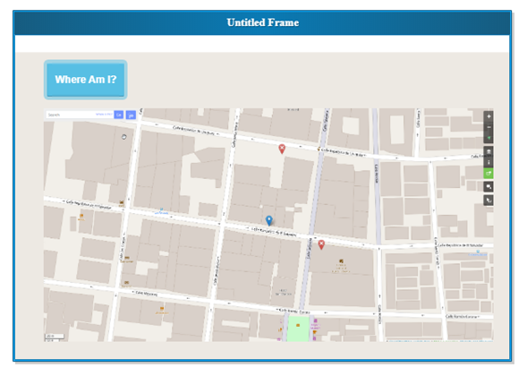

<!-- markdownlint-disable-file MD029 -->

# 1. Proyecto final - SpringBoot - ip-locator

Este es el proyecto final de la clase híbrida llamada Modern Cloud Engineering.

- [1. Proyecto final - SpringBoot - ip-locator](#1-proyecto-final---springboot---ip-locator)
  - [1.1. Integrantes](#11-integrantes)
  - [1.2. Requerimientos del proyecto](#12-requerimientos-del-proyecto)
  - [1.3. Recursos de apoyo](#13-recursos-de-apoyo)
  - [1.4. Instalación y uso](#14-instalación-y-uso)

## 1.1. Integrantes

- Karla Patricia Cupul Gómez
- [Roger Isaac Barrera Navarrete](https://www.linkedin.com/in/ribn/)
- Alejandro Ochoa Alvarez

## 1.2. Requerimientos del proyecto

Diseñar una página web que muestre tu dirección en un mapa en base a la IP

La página web debe de ser de la siguiente manera:



Para ello se deberá elaborar una aplicación en *Spring Boot* que cumpla con dos cosas:

- Publique un servicio que no reciba parámetros y genere la URL del mapa
- Una página web con un botón y un ``iframe``, al dar clic en el botón invocará al servicio del punto anterior y cargara la imagen en el ``iframe``.

El servicio por desarrollar deberá hacer lo siguiente

1. Invocar el API publica [https://api.ipify.org/?format=json](https://api.ipify.org/?format=json) con la que obtendrá la dirección IP desde la cual sale la petición.\
Ejemplo de respuesta:

```json
{
  "ip":"187.188.9.161"
}
```

2. Usar esa dirección IP para invocar el servicio [https://ipinfo.io/187.188.9.161/geo](https://ipinfo.io/187.188.9.161/geo), que obtendrá entre otras cosas la latitud y longitud ejemplo de respuesta

```json
{
  "ip":"187.188.9.161",
  "hostname":"fixed-187-188-9-161.totalplay.net",
  "city":"Mexico City",
  "region":"Mexico City",
  "country":"MX",
  "loc":"19.4285,-99.1277",
  "org":"AS17072 TOTAL PLAY TELECOMUNICACIONES SA DE CV",
  "postal":"03020",
  "timezone":"America/Mexico_City",
  "readme":"https://ipinfo.io/missingauth"
}
```

3. Usar la longitud y latitud para armar una URL que será regresada por el servicio para generar la URL del mapa usando el API de *openstreetmap*, [https://www.openstreetmap.org/?mlat=19.4285&mlon=-99.1277#map=18/19.42850/-99.12770&layers=N](https://www.openstreetmap.org/?mlat=19.4285&mlon=-99.1277#map=18/19.42850/-99.12770&layers=N)\
Este valor lo regresara en un json de la siguiente forma

```json
{
  "url": "https://www.openstreetmap.org/?mlat=19.4285&mlon=-99.1277#map=18/19.42850/-99.12770&layers=N"
}
```

4. La página web deberá usar jquery para llamar al servicio después de dar clic al botón

```javascript
$.get("http://myservicio", function(data) {
    document.getElementById("iframeid").src = data.url;
});
```


Entregar el código fuente (proyecto del servicio) en un archivo ``zip``

El proyecto deberá compilar con el comando "``mvn clean install``" (instalar Maven)

Incluir un archivo ``readme.txt`` con las instrucciones para levantar y probar el código.

**Enviar el proyecto por correo a más tardar el miércoles 14 de diciembre.**

Tema: UADY | Proyecto Final SpringBoot | **nombre**

Enviar a: [j.a.aguilar.puch@accenture.com][mail:aguilar]

Con copia: [yadira.p.velazquez@accenture.com][mail:yadira]

## 1.3. Recursos de apoyo

Se utilizarán los siguientes recursos para el desarrollo del proyecto:

- [*Curso de Arquitectura Java Spring Boot*][url:arquitecturajava]
- [*Spring Boot - MitoCode*][url:MitoCode]
- [*Curso Spring Boot desde cero (Framework Java) - Brain Data Center*][url:BrainDataCenter]

Y como recursos adicionales:

- [*Spring Boot*][springio]
- [*Spring Boot Microservices Level 1: Communication and Discovery - Java Brains*][javabrains]

## 1.4. Instalación y uso

Para compilar el programa en window se debe ejecutar el siguiente comando en la carpeta ``ip-locator`` (la raíz) del proyecto usando la consola de comandos de ``PowerShell``:

```powershell
.\mvnw clean install
```

Esto instalará las dependencias y generará el archivo ``.jar`` en la carpeta [``target``](target).

Para correr el programa se debe ejecutar el siguiente comando:

```powershell
.\mvnw "spring-boot:run"
```

o también se puede usar el siguiente comando para correr el programa:

```powershell
java -jar "target\ip_locator-0.0.1-SNAPSHOT.jar"
```

Se accede al navegador con la siguiente URL: [http://localhost:8080/](http://localhost:8080/)

Y se obtiene la siguiente página:

![Página de inicio][capturaapp]

De esta página se puede dar clic en el botón ``¿En dónde estoy?`` para obtener la ubicación del usuario.

Finalmente se obtiene el mapa de la ubicación del usuario.\
**Nota:** *Por alguna razón el mapa no muestra el marcador de la ubicación del usuario, solo se traslada a las coordenadas aproximadas.*

Alternativamente se puede usar el siguiente endpoint para obtener el url del mapa:

```http
GET http://localhost:8080/api/v1/position
```

[mail:yadira]: mailto:yadira.p.velazquez@accenture.com
[mail:aguilar]: mailto:j.a.aguilar.puch@accenture.com
[url:arquitecturajava]: https://cursos.arquitecturajava.com/p/spring-boot1
[url:MitoCode]: https://youtube.com/playlist?list=PLvimn1Ins-40wR4PC-YtTQ5TKt3vRrVwl
[url:BrainDataCenter]: https://youtube.com/playlist?list=PLCIjncxyvEHbSAhlMhSrMROJtg1s_tlG8
[javabrains]: https://youtube.com/playlist?list=PLqq-6Pq4lTTZSKAFG6aCDVDP86Qx4lNas
[springio]: https://spring.io/projects/spring-boot
[capturaapp]: img/captura_app.jpeg
