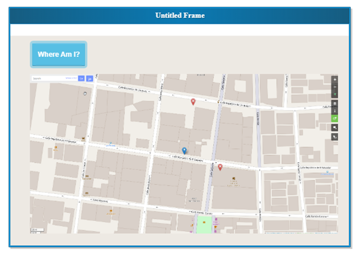
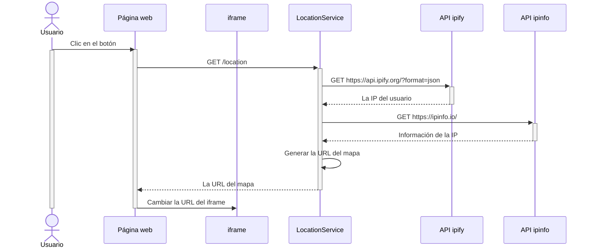

<!-- markdownlint-disable MD029 -->
# 1. Proyecto final - SpringBoot - ip-locator

Este es el proyecto final de la clase híbrida llamada Modern Cloud Engineering.

- [1. Proyecto final - SpringBoot - ip-locator](#1-proyecto-final---springboot---ip-locator)
  - [1.1. Integrantes](#11-integrantes)
  - [1.2. Requerimientos del proyecto](#12-requerimientos-del-proyecto)
  - [1.3. Explicación del código](#13-explicación-del-código)

## 1.1. Integrantes
<!-- TODO: Agregar el nombre completo de Sheila -->
- Karla Patricia Cupul Gómez
- [Roger Isaac Barrera Navarrete](https://www.linkedin.com/in/ribn/)
- Sheila

## 1.2. Requerimientos del proyecto

Diseñar una página web que muestre tu dirección en un mapa en base a la IP

La página web debe de ser de la siguiente manera:



Para ello se deberá elaborar una aplicación en *Spring Boot* que cumpla con dos cosas:

- Publique un servicio que no reciba parámetros y genere la URL del mapa
- Una página web con un botón y un ``iframe``, al dar clic en el botón invocará al servicio del punto anterior y cargara la imagen en el ``iframe``.

El servicio por desarrollar deberá hacer lo siguiente

1. Invocar el API publica [https://api.ipify.org/?format=json](https://api.ipify.org/?format=json) con la que obtendrá la dirección IP desde la cual sale la petición.\
Ejemplo de respuesta: ``{"ip":"187.188.9.161"}``

2. Usar esa dirección IP para invocar el servicio [https://ipinfo.io/187.188.9.161/geo](https://ipinfo.io/187.188.9.161/geo), que obtendrá entre otras cosas la latitud y longitud ejemplo de respuesta

```json
{
  "ip":"187.188.9.161",
  "hostname":"fixed-187-188-9-161.totalplay.net",
  "city":"Mexico City",
  "region":"Mexico City",
  "country":"MX",
  "loc":"19.4285,-99.1277",
  "org":"AS17072 TOTAL PLAY TELECOMUNICACIONES SA DE CV",
  "postal":"03020",
  "timezone":"America/Mexico_City",
  "readme":"https://ipinfo.io/missingauth"
}
```

3. Usar la longitud y latitud para armar una URL que será regresada por el servicio para generar la URL del mapa usando el API de *openstreetmap*, [https://www.openstreetmap.org/?mlat=19.4285&mlon=-99.1277#map=18/19.42850/-99.12770&layers=N](https://www.openstreetmap.org/?mlat=19.4285&mlon=-99.1277#map=18/19.42850/-99.12770&layers=N)\
Este valor lo regresara en un json de la siguiente forma

```json
{
  "url": "https://www.openstreetmap.org/?mlat=19.4285&mlon=-99.1277#map=18/19.42850/-99.12770&layers=N"
}
```

4. La página web deberá usar jquery para llamar al servicio después de dar clic al botón

```javascript
$.get("http://myservicio", function(data) {
    document.getElementById("iframeid").src = data.url;
});
```



Entregar el código fuente (proyecto del servicio) en un archivo ``zip``

El proyecto deberá compilar con el comando "``mvn clean install``" (instalar Maven)

Incluir un archivo ``readme.txt`` con las instrucciones para levantar y probar el código.

**Enviar el proyecto por correo a más tardar el jueves 14 de diciembre.**

Tema: UADY | Proyecto Final SpringBoot | **nombre**

Enviar a: [j.a.aguilar.puch@accenture.com][mailaguilar]

Con copia: [yadira.p.velazquez@accenture.com][mail_yadira]

## 1.3. Explicación del código

[mail_yadira]: mailto:yadira.p.velazquez@accenture.com
[mailaguilar]: mailto:j.a.aguilar.puch@accenture.com
